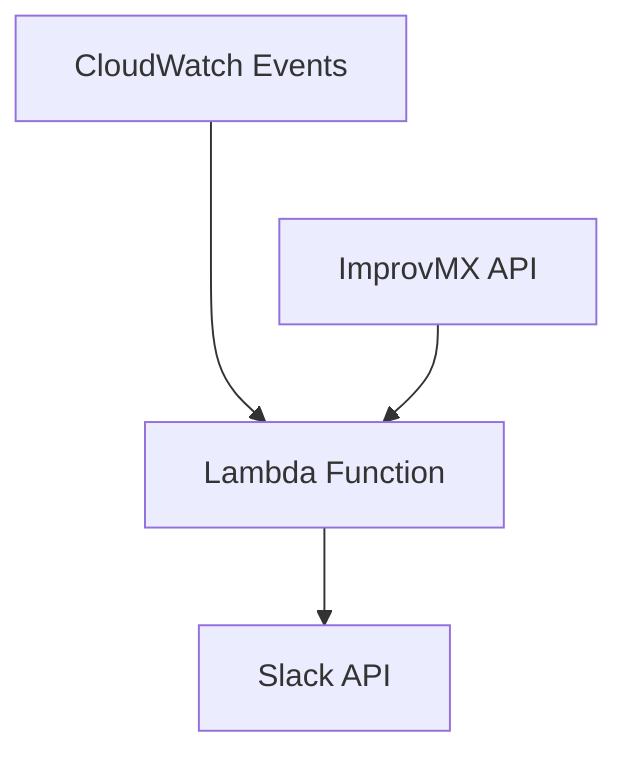

# Description

If you sign up for ImprovMX email forwarding for your personal or business use,
you might experience some important emails being flagged as spam and not delivered to your mailbox at all.

This serverless application hosted in AWS Lambda monitors ImprovMX logs
and sends undelivered email alerts to a Slack channel.

# Requirements

* AWS Account (Free tier eligible)
* ImprovMX Account (Free plan available)

# Setup
